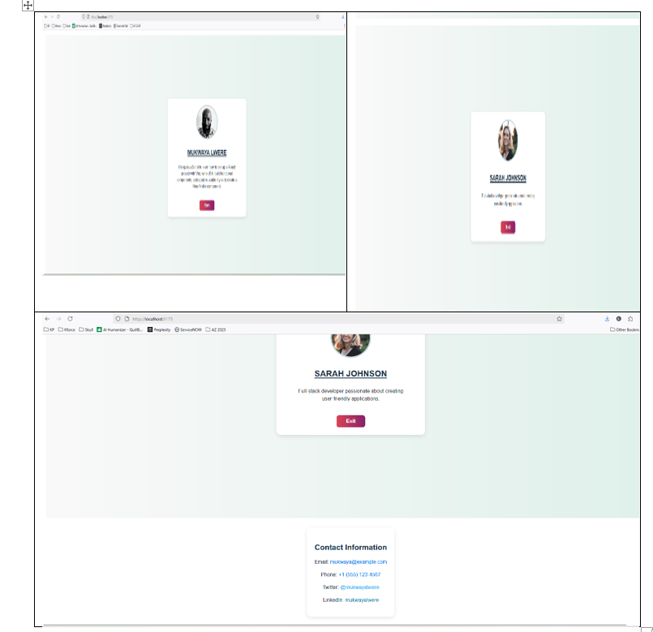

# Module 9A - Build Your First React Component

## An explanation
This React application renders a reusable `UserProfile` component and was made with Vite. 
On a stylized card, the `UserProfile` component shows a user's name, profile picture, and a synopsis. 
It provides a simple and contemporary design by centering the card both horizontally and vertically inside the viewport using inline CSS.

Additionally, each profile card has a **Exit** button that, when clicked, tries to close the tab or window that is currently open in the browser (though, for security reasons, this might only work on windows that are opened programmatically by JavaScript).

### Parts Props:
- **name**: A string that contains the user's entire name.
- **bio**: A string with the user's brief biography or description.
- **profileImage**: An imported image path or string URL that points to the user's profile picture.

## Knowledge Acquired:
- How to Use Vite to Set Up a React Project
- Vite makes it simple and quick to set up a React project. 
- The command npm create vite@latest <project-name> --template react swiftly scaffolds a simple, optimized React application. 
- Compared to conventional configurations, Vite's rapid development server with hot module replacement (HMR) speeds up iteration. 
- After scaffolding finishes the setup, npm install is used to manage dependencies. 
- Because of the project's straightforward structure, adding custom components is quick and easy.

## Writing and Organizing a Useful React Component:
- Simple JavaScript functions that return JSX are known as React functional components. 
- Props enable components to be dynamic and reusable. 
- For instance, your UserProfile component allows you to render various user data with the same component by accepting name, bio, and profileImage props. 
- Logic is kept contained by arranging inline functions, such as event handlers (handleExit, for example), inside the component. 
- Readability and maintenance are enhanced by concise JSX markup and a clear division of responsibilities.

## How to Utilize Inline Styles and JSX:
- Writing HTML-like structures inside JavaScript is made possible by the JSX syntax, which React then converts into effective DOM updates. 
- In React, inline styles are defined as - JavaScript objects, with values being strings or numbers and hyphens in CSS properties being replaced with camelCase keys. 
- For component-scoped, dynamic styling without the need for external CSS files, this method is useful. 
- To produce contemporary and responsive UI layouts fast, use meaningful and consistent inline styles.

## How to Render an App.jsx Component:
- Rendering other components begins with the root React component (App.jsx). 
- Complex user interfaces can be created using reusable building blocks by importing components such as UserProfile into App.jsx and including them inside its JSX. 
- Rich, dynamic content can be rendered by passing various props to those components. 
- Layout can also be controlled by directly using styled containers (like flexbox) or wrapping elements in HTML in App.jsx.

Together, these lessons show how modern React development with Vite allows for dynamic styling, modular UI development, and quick startup, enabling you to produce well-designed and effective web applications.

## Challenges
- I initially had issues starting the dev server due to PowerShell policy. 
- Resolved it by running `Set-ExecutionPolicy Bypass`.
to enable the development server and temporarily permit script execution.  
- I discovered that Windows PowerShell has security features that can prevent scripts from running, particularly when utilizing the terminal inside of editors like Visual Studio Code.  
- Acknowledged that in order to successfully modify execution policies, PowerShell must be run as administrator.  
- Minor Git configuration problems, like "remote origin already exists," were fixed by confirming that the remotes were already in place in order to prevent adding duplicates.  
- In a Vite-powered project, I oversaw the intricacy of managing local asset paths versus URLs for images in React components, making sure the right relative imports were made.

These challenges gave me invaluable practical experience with Windows security policies, environment setup, and best practices for version control and asset management in React projects made with Vite.

## Screenshot

